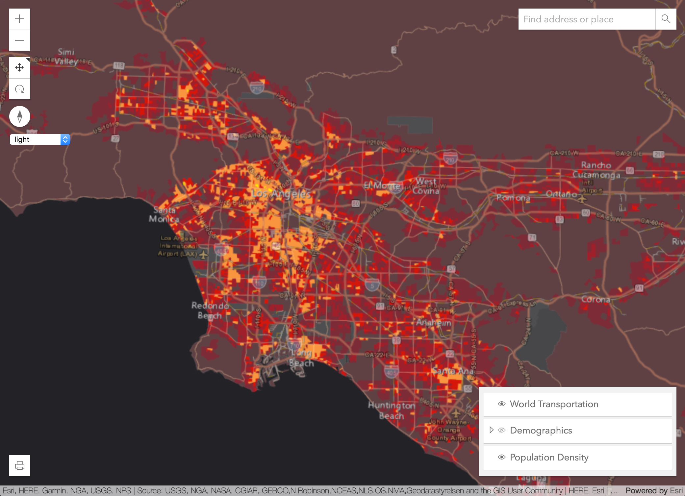
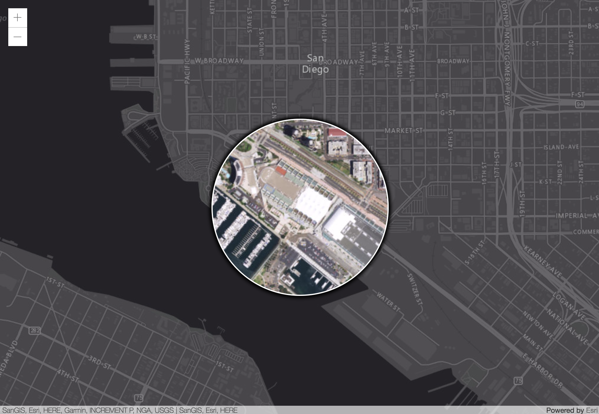

<!-- .slide: data-background="img/bg-1.png" data-background-size="cover" style="padding-left: 80px;" -->
<!-- Presenter: Matt -->

# Developing Your Own Widget with the ArcGIS API for JavaScript

### Matt Driscoll – [@driskull](https://twitter.com/driskull)
### JC Franco – [@arfncode](https://twitter.com/arfncode)

---

# Agenda

- Widgets
- Theming
- Widget Framework
- Putting it all together

---


# Widgets

---

# About

- What?                                         <!-- .element: class="fragment" data-fragment-index="1" -->
  - Encapsulated UI components                  <!-- .element: class="fragment" data-fragment-index="2" -->
  - Cohesive (integrated, unified)              <!-- .element: class="fragment" data-fragment-index="3" -->
  - Single-purpose pieces of functionality      <!-- .element: class="fragment" data-fragment-index="4" -->
- Why?                                          <!-- .element: class="fragment" data-fragment-index="5" -->
  - Reusable                                    <!-- .element: class="fragment" data-fragment-index="6" -->
  - Interchangeable                             <!-- .element: class="fragment" data-fragment-index="7" -->
- How?                                          <!-- .element: class="fragment" data-fragment-index="8" -->
  - Different frameworks are available          <!-- .element: class="fragment" data-fragment-index="9" -->

---

# Widget Theming

---

# About

- Why?                  <!-- .element: class="fragment" data-fragment-index="1" -->
  - Consistency         <!-- .element: class="fragment" data-fragment-index="2" -->
    - Visual            <!-- .element: class="fragment" data-fragment-index="3" -->
    - Functional        <!-- .element: class="fragment" data-fragment-index="3" -->
  - User options        <!-- .element: class="fragment" data-fragment-index="4" -->
    - Out-of-the-box    <!-- .element: class="fragment" data-fragment-index="5" -->
    - Custom            <!-- .element: class="fragment" data-fragment-index="6" -->
- How?                  <!-- .element: class="fragment" data-fragment-index="7" -->
  - Sass                <!-- .element: class="fragment" data-fragment-index="8" -->
  - BEM                 <!-- .element: class="fragment" data-fragment-index="9" -->

---

# Out-of-the-box themes

[Theme Switcher](../demos/themes/)



---

# Theming with Sass

- CSS preprocessor                  <!-- .element: class="fragment" data-fragment-index="1" -->
- Powered-up CSS                     <!-- .element: class="fragment" data-fragment-index="2" -->
  - Nesting                          <!-- .element: class="fragment" data-fragment-index="3" -->
  - Variables                         <!-- .element: class="fragment" data-fragment-index="4" -->
  - Functions                         <!-- .element: class="fragment" data-fragment-index="5" -->
  - Mixins                            <!-- .element: class="fragment" data-fragment-index="6" -->
  - Inheritance                       <!-- .element: class="fragment" data-fragment-index="7" -->

---

# Sass makes it easier to...

- Restyle                            <!-- .element: class="fragment" data-fragment-index="1" -->
- Organize                           <!-- .element: class="fragment" data-fragment-index="3" -->
- Write less code :)                 <!-- .element: class="fragment" data-fragment-index="4" -->

---

# Naming CSS classes: [BEM](http://getbem.com/)

#### Block Element Modifier

- Semantic                      <!-- .element: class="fragment" data-fragment-index="1" -->
- Low specificity               <!-- .element: class="fragment" data-fragment-index="2" -->
- Scopes styles to blocks       <!-- .element: class="fragment" data-fragment-index="3" -->

```scss
// block
.example-widget {}

// block__element
.example-widget__input {}

// block--modifier
.example-widget--loading {}

// block__element--modifier
.example-widget__input--disabled {}
```
<!-- .element: class="fragment" data-fragment-index="4" -->

---

# Recap

- Consistency              <!-- .element: class="fragment" data-fragment-index="1" -->
- User options             <!-- .element: class="fragment" data-fragment-index="2" -->
- Authoring                <!-- .element: class="fragment" data-fragment-index="3" -->

---

<!-- Presenter: JC -->

# Widget Framework

---

# About

- Views + ViewModels         <!-- .element: class="fragment" data-fragment-index="1" -->
 - Separation of concerns    <!-- .element: class="fragment" data-fragment-index="2" -->
 - Reusable                  <!-- .element: class="fragment" data-fragment-index="3" -->
   - UI replacement            <!-- .element: class="fragment" data-fragment-index="4" -->
   - Easier integration     <!-- .element: class="fragment" data-fragment-index="5" -->
- Built with TypeScript     <!-- .element: class="fragment" data-fragment-index="6" -->

---

# Views

- Extend esri/widgets/Widget      <!-- .element: class="fragment" data-fragment-index="1" -->
- Rely on ViewModel                 <!-- .element: class="fragment" data-fragment-index="2" -->
- Focus on UI                       <!-- .element: class="fragment" data-fragment-index="3" -->

---

# ViewModels

- Extend esri/core/Accessor       <!-- .element: class="fragment" data-fragment-index="1" -->
- Provide APIs to support view                    <!-- .element: class="fragment" data-fragment-index="2" -->
- Focus on business logic                    <!-- .element: class="fragment" data-fragment-index="3" -->

---

# `esri/widgets/Widget`

- Lifecycle         <!-- .element: class="fragment" data-fragment-index="1" -->
- API consistency    <!-- .element: class="fragment" data-fragment-index="2" -->
  - Unified object constructor          <!-- .element: class="fragment" data-fragment-index="3" -->
  - Properties                          <!-- .element: class="fragment" data-fragment-index="4" -->
  - Watching                            <!-- .element: class="fragment" data-fragment-index="5" -->

---

# Lifecycle

- constructor         <!-- .element: class="fragment" data-fragment-index="1" -->
- postInitialize      <!-- .element: class="fragment" data-fragment-index="2" -->
- render              <!-- .element: class="fragment" data-fragment-index="3" -->
- destroy             <!-- .element: class="fragment" data-fragment-index="8" -->

---

# `render`

- Defines UI                <!-- .element: class="fragment" data-fragment-index="1" -->
- Reacts to state           <!-- .element: class="fragment" data-fragment-index="2" -->
- Uses JSX                  <!-- .element: class="fragment" data-fragment-index="3" -->

```js
render() {
  const x = Number(x).toFixed(3);
  const y = Number(y).toFixed(3);
  const scale = Number(scale).toFixed(5);

  return (
    <div bind={this} class={CSS.base} onclick={this._handleClick}>
      <p>x: {x}</p>
      <p>y: {y}</p>
      <p>scale: {scale}</p>
    </div>
  );
}
```
<!-- .element: class="fragment current-visible" data-fragment-index="4" -->

---

# TypeScript

- Typed JavaScript <!-- .element: class="fragment" data-fragment-index="1" -->

```ts
type PresenterName = "Matt" | "JC";

interface Person {
  name: string;
}

interface Presenter extends Person {
  name: PresenterName;
}

// TS2322: Type '{ name: "Alan" };' is not assignable to type 'Presenter'.
const myPresenter: Presenter = { name: "Alan" };
```
<!-- .element: class="fragment hidden" data-fragment-index="2" -->

---

# TypeScript

- JS of the future, now

```ts
// const
const numbers = [1, 2, 3];

// fat arrow functions
letters.forEach(letter => console.log(letter));

// template literals
const myString = `last number: ${ numbers[ numbers.length - 1 ] }`;

// decorators
class Example {
  @log
  stringify(item: object): string { /* ... */ }
}
```
<!-- .element: class="fragment" data-fragment-index="1" -->

---

# TypeScript

- IDE support
  - Visual Studio, WebStorm, Sublime, and more!  <!-- .element: class="fragment" data-fragment-index="1" -->

---

# Defining a class

```ts
/// <amd-dependency path="esri/core/tsSupport/declareExtendsHelper" name="__extends" />
/// <amd-dependency path="esri/core/tsSupport/decorateHelper" name="__decorate" />

import { declared, subclass } from "esri/core/accessorSupport/decorators";
 
import Base = require("my/class/base");

@subclass("MyClass")
class MyClass extends declared(Base) {

}

export = MyClass;
```

---

# Defining a variable

```ts
// ...

@subclass("MyClass")
class MyClass extends declared(Base) {

  // adds variable `_foo` 
  _foo: Foo = new Foo();
  
}

// ...
```

---

# Defining a property

```ts
// ...

@subclass("MyClass")
class MyClass extends declared(Base) {

  // adds property `foo` 
  @property()
  foo: Foo = new Foo();
  
}

// ...
```

---

# Defining a method

```ts
// ...

@subclass("MyClass")
class MyClass extends declared(Base) {

  // adds method `bar` 
  bar(): string {
    return this._getText();
  }
  
  private _getText(): string {
    // gets text
  }
  
}

// ...
```

---

# Widget decorators

- @subclass + declared      <!-- .element: class="fragment" data-fragment-index="1" -->
- @property                 <!-- .element: class="fragment" data-fragment-index="2" -->
  - autocast                <!-- .element: class="fragment" data-fragment-index="3" -->
  - computed                <!-- .element: class="fragment" data-fragment-index="4" -->
  - read-only               <!-- .element: class="fragment" data-fragment-index="5" -->
  - aliased                 <!-- .element: class="fragment" data-fragment-index="6" -->
- @aliasOf                  <!-- .element: class="fragment" data-fragment-index="7" -->
- @renderable               <!-- .element: class="fragment" data-fragment-index="8" -->
- @accessibleHandler        <!-- .element: class="fragment" data-fragment-index="9" -->

---

# Recap

- Views + ViewModels           <!-- .element: class="fragment" data-fragment-index="1" -->
- esri/widgets/Widget     <!-- .element: class="fragment" data-fragment-index="2" -->
- TypeScript     <!-- .element: class="fragment" data-fragment-index="3" -->

---

<!-- Presenter: Matt -->

# Let's build a widget!


[Bookmarks](../demos/bookmarks-complete)



---

# Let's build a widget!


- [Demo Start](../demos/bookmarks-start/)
- [HTML Steps](https://github.com/jcfranco/ds-2018-developing-your-own-widget/blob/master/demos/HTML-steps.md)
- [ViewModel Steps](https://github.com/jcfranco/ds-2018-developing-your-own-widget/blob/master/demos/ViewModel-steps.md)
<!-- Presenter: JC -->
- [View Steps](https://github.com/jcfranco/ds-2018-developing-your-own-widget/blob/master/demos/View-steps.md)
- [Sass Steps](https://github.com/jcfranco/ds-2018-developing-your-own-widget/blob/master/demos/Sass-steps.md)

---

<!-- Presenter: Matt -->

# Let's Recap

- Widgets are single functionality UI components
- We use them for reusability/interchangeability
- Widget Themes
  - SASS
- Widget Framework
- Constructing a widget
  - ViewModels
  - Views

---

## Suggested Session

- [ArcGIS API for JavaScript: Customizing Widgets](https://devsummit2018.schedule.esri.com/schedule/1073688966)

---

## Additional Resources

- [Styling](https://developers.arcgis.com/javascript/latest/guide/styling/index.html)
- [Implementing Accessor](https://developers.arcgis.com/javascript/latest/guide/implementing-accessor/index.html)
- [Setting up TypeScript](https://developers.arcgis.com/javascript/latest/guide/typescript-setup/index.html)
- [Widget Development](https://developers.arcgis.com/javascript/latest/guide/custom-widget/index.html)
- [JS API SDK](https://developers.arcgis.com/javascript/)

---

# Use the source, Luke

## [esriurl.com/buildwidgetsds2018](http://esriurl.com/buildwidgetsds2018)

---


---

# Questions?

---

<!-- .slide: data-background="img/bg-final.jpg" -->

# Thank you!

---


