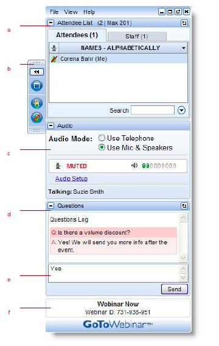
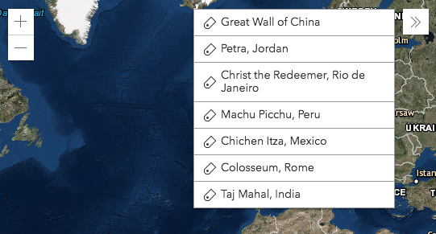

<!-- .slide: data-background="img/bg-1.png" data-background-size="cover" -->
<!-- Presenter: Matt -->

# Building a Widget Using the ArcGIS JSAPI

### Matt Driscoll – [@driskull](https://twitter.com/driskull)
### JC Franco – [@arfncode](https://twitter.com/arfncode)

---



---

# Building a Widget Using the ArcGIS JSAPI

### Matt Driscoll – [@driskull](https://twitter.com/driskull)
### JC Franco – [@arfncode](https://twitter.com/arfncode)

---

## Agenda

- About Widgets
- Widget Framework
- Styling
- Build A Widget!

---

<!-- .slide: data-background="img/bg-4.png" data-background-size="cover" -->

# Widgets

---

## About Widgets

- What?                                         <!-- .element: class="fragment" data-fragment-index="1" -->
  - Encapsulated UI components                  
  - Cohesive (integrated, unified)             
  - Single-purpose pieces of functionality      
- Why?                                          <!-- .element: class="fragment" data-fragment-index="2" -->
  - Reusable                                    
  - Interchangeable                             
- How?                                          <!-- .element: class="fragment" data-fragment-index="3" -->
  - esri/Widgets/Widget                      

---

<!-- .slide: data-background="img/bg-4.png" data-background-size="cover" -->
<!-- Presenter: JC -->

# Widget Framework

---

## Architecture

- Views + ViewModels         <!-- .element: class="fragment" data-fragment-index="1" -->
 - Separation of concerns    <!-- .element: class="fragment" data-fragment-index="2" -->
 - Reusable                  <!-- .element: class="fragment" data-fragment-index="3" -->
   - UI replacement            <!-- .element: class="fragment" data-fragment-index="4" -->
   - Easier integration     <!-- .element: class="fragment" data-fragment-index="5" -->
- Built with TypeScript     <!-- .element: class="fragment" data-fragment-index="6" -->

---

## Views

- <!-- .element: class="fragment" data-fragment-index="1" --> Extend `esri/widgets/Widget`
- Rely on ViewModel                 <!-- .element: class="fragment" data-fragment-index="2" -->
- Focus on UI                       <!-- .element: class="fragment" data-fragment-index="3" -->

---

## ViewModels

<!-- front-loaded to fade entire fragment -->
- <!-- .element: class="fragment" data-fragment-index="1" --> Extend `esri/core/Accessor`
- Provide APIs to support view                    <!-- .element: class="fragment" data-fragment-index="2" -->
- Focus on business logic                    <!-- .element: class="fragment" data-fragment-index="3" -->

---

## View + ViewModel in action

* View renders its state                          <!-- .element: class="fragment" data-fragment-index="1" -->
  * state = view + ViewModel props                <!-- .element: class="fragment" data-fragment-index="2" -->
* View calls VMs APIs                             <!-- .element: class="fragment" data-fragment-index="3" -->
  * causes a change (e.g., property or result)    <!-- .element: class="fragment" data-fragment-index="4" -->
* View updates                                    <!-- .element: class="fragment" data-fragment-index="5" -->

---

## `esri/widgets/Widget`

- Lifecycle         <!-- .element: class="fragment" data-fragment-index="1" -->
- API consistency    <!-- .element: class="fragment" data-fragment-index="2" -->
  - Unified object constructor          <!-- .element: class="fragment" data-fragment-index="3" -->
  - Properties                          <!-- .element: class="fragment" data-fragment-index="4" -->
  - Watching                            <!-- .element: class="fragment" data-fragment-index="5" -->

---

## Lifecycle

- <!-- .element: class="fragment" data-fragment-index="1" --> `constructor`
- <!-- .element: class="fragment" data-fragment-index="2" --> `postInitialize`
- <!-- .element: class="fragment" data-fragment-index="3" --> `render`
- <!-- .element: class="fragment" data-fragment-index="4" --> `destroy`

---

## `render()`

- Defines UI                <!-- .element: class="fragment" data-fragment-index="1" -->
- Reacts to state           <!-- .element: class="fragment" data-fragment-index="2" -->
- Uses JSX                  <!-- .element: class="fragment" data-fragment-index="3" -->
- VDOM                      <!-- .element: class="fragment" data-fragment-index="4" -->

---

## `render()` example

```ts
render() {
  const { x, y, scale }  = this;

  return (
    <div bind={this} class={CSS.base} onclick={this._handleClick} 
         title="map info" tabIndex={0}>
      <p>x: {x}</p>
      <p>y: {y}</p>
      <p>scale: {scale}</p>
    </div>
  );
}
```

[Widget rendering](https://developers.arcgis.com/javascript/latest/guide/custom-widget/index.html#widget-rendering) <!-- .element: class="fragment" data-fragment-index="1" -->

---

<!-- .slide: data-background="img/bg-4.png" data-background-size="cover" -->

# Implementing

---

## Implementing

- @subclass + declared      <!-- .element: class="fragment" data-fragment-index="1" -->
- @property                 <!-- .element: class="fragment" data-fragment-index="2" -->
  - autocast                <!-- .element: class="fragment" data-fragment-index="3" -->
  - computed                <!-- .element: class="fragment" data-fragment-index="4" -->
  - read-only               <!-- .element: class="fragment" data-fragment-index="5" -->
  - aliased                 <!-- .element: class="fragment" data-fragment-index="6" -->
- @aliasOf                  <!-- .element: class="fragment" data-fragment-index="7" -->
- @renderable               <!-- .element: class="fragment" data-fragment-index="8" -->
- @accessibleHandler        <!-- .element: class="fragment" data-fragment-index="9" -->

---

## Implementing

- <!-- .element: class="fragment" data-fragment-index="1" --> Extend `esri/widgets/Widget`

```ts
/// <amd-dependency path="esri/core/tsSupport/declareExtendsHelper" name="__extends" />
/// <amd-dependency path="esri/core/tsSupport/decorateHelper" name="__decorate" />

@subclass("MyWidget")
class MyWidget extends declared(Widget) {

}

export = MyWidget;
```
<!-- .element: class="fragment" data-fragment-index="1" -->

---

## Implementing

- <!-- .element: class="fragment" data-fragment-index="1" --> Implement `render`

```ts
// ...
class MyWidget extends declared(Widget) {
  render() {
    return (
      <div>I'm a widget</div>
    );
  }
}
// ...
```
<!-- .element: class="fragment" data-fragment-index="1" -->

---

## Implementing

- <!-- .element: class="fragment" data-fragment-index="1" --> Define properties

```ts
// ...
  @property()
  @renderable()
  name: string = "I'm a widget";

  render() {
    return (
      <div>{this.name}</div>
    );
  }
// ...
```
<!-- .element: class="fragment" data-fragment-index="1" -->

---

## Animation hooks

* <!-- .element: class="fragment" data-fragment-index="0" --> CSS **or** JS
* Node attributes <!-- .element: class="fragment" data-fragment-index="1" -->
  *  <!-- .element: class="fragment" data-fragment-index="1" --> `enterAnimation`
  *  <!-- .element: class="fragment" data-fragment-index="1" --> `exitAnimation`
  *  <!-- .element: class="fragment" data-fragment-index="1" --> `updateAnimation` (JS-only)
*  <!-- .element: class="fragment" data-fragment-index="2" --> `cssTransition` (CSS-only)

---

## Animation hooks

```ts
render() {
  const { visible } = this;
  
  const content = visible ? (
    <div enterAnimation={cssTransition("enter", CSS.fadeIn)} 
         exitAnimation={cssTransition("exit", CSS.fadeOut)}>{/*...*/}</div>
  ) : null; 
  
  return (
    <div class={CSS.base}>
      {content}
    </div>
  );
}
```

 <!-- .element: class="fragment" data-fragment-index="1" -->

---

## Recap

- Views + ViewModels <!-- .element: class="fragment" data-fragment-index="1" -->
- <!-- .element: class="fragment" data-fragment-index="2" --> `esri/widgets/Widget`
- <!-- .element: class="fragment" data-fragment-index="3" --> `render()`

---

<!-- .slide: data-background="img/bg-4.png" data-background-size="cover" -->

# Styling

---

## Styling with [Sass](https://sass-lang.com/)

- CSS preprocessor                  <!-- .element: class="fragment" data-fragment-index="1" -->
- Powered-up CSS                     <!-- .element: class="fragment" data-fragment-index="2" -->
  - Nesting                          <!-- .element: class="fragment" data-fragment-index="3" -->
  - Variables                         <!-- .element: class="fragment" data-fragment-index="4" -->
  - Functions                         <!-- .element: class="fragment" data-fragment-index="5" -->
  - Mixins                            <!-- .element: class="fragment" data-fragment-index="6" -->
  - Inheritance                       <!-- .element: class="fragment" data-fragment-index="7" -->

---

## Recap

- Sass makes it easier to...
  - Restyle                            <!-- .element: class="fragment" data-fragment-index="1" -->
  - Organize                           <!-- .element: class="fragment" data-fragment-index="3" -->
  - Write less code :)                 <!-- .element: class="fragment" data-fragment-index="4" -->

---

<!-- .slide: data-background="img/bg-5.png" data-background-size="cover" -->
<!-- Presenter: Matt -->

# Let's build a widget!

---

## Building A Bookmarks Widget

- [Bookmarks Doc](https://developers.arcgis.com/javascript/latest/api-reference/esri-WebMap.html#bookmarks)
- [Bookmarks Completed Demo](../demos/bookmarks-complete)



---

## VM: API Design

```ts
interface BookmarksViewModel {
  bookmarkItems: Collection<BookmarkItem>;
  state: "loading" | "ready" | "disabled"; // will be computed property
  view: MapView;
  goTo(item: BookmarkItem): IPromise<any>;
}

interface BookmarkItem {
  active: Boolean;
  extent: Extent;
  name: string;
}
```

---

## Build Steps

- [Demo Start](../demos/bookmarks-start/)
- [HTML Steps](https://github.com/jcfranco/geodev-webinar-2018-building-your-own-widget/blob/master/demos/HTML-steps.md)
- [ViewModel Steps](https://github.com/jcfranco/geodev-webinar-2018-building-your-own-widget/blob/master/demos/ViewModel-steps.md)
<!-- Presenter: JC -->
- [View Steps](https://github.com/jcfranco/geodev-webinar-2018-building-your-own-widget/blob/master/demos/View-steps.md)
- [Sass](https://github.com/jcfranco/geodev-webinar-2018-building-your-own-widget/blob/master/demos/Sass-steps.md)

---

<!-- Presenter: Matt -->

# Closing

---

## Let's Recap

- Widgets are single functionality UI components
- We use them for reusability/interchangeability
- Widget Framework
- Constructing a widget
  - ViewModels
  - Views
- Styling
  - Sass

---

<!-- .slide: data-background="img/bg-final.png" -->

# Thank you!


[esriurl.com/widgetswebinar2018](http://esriurl.com/widgetswebinar2018)

